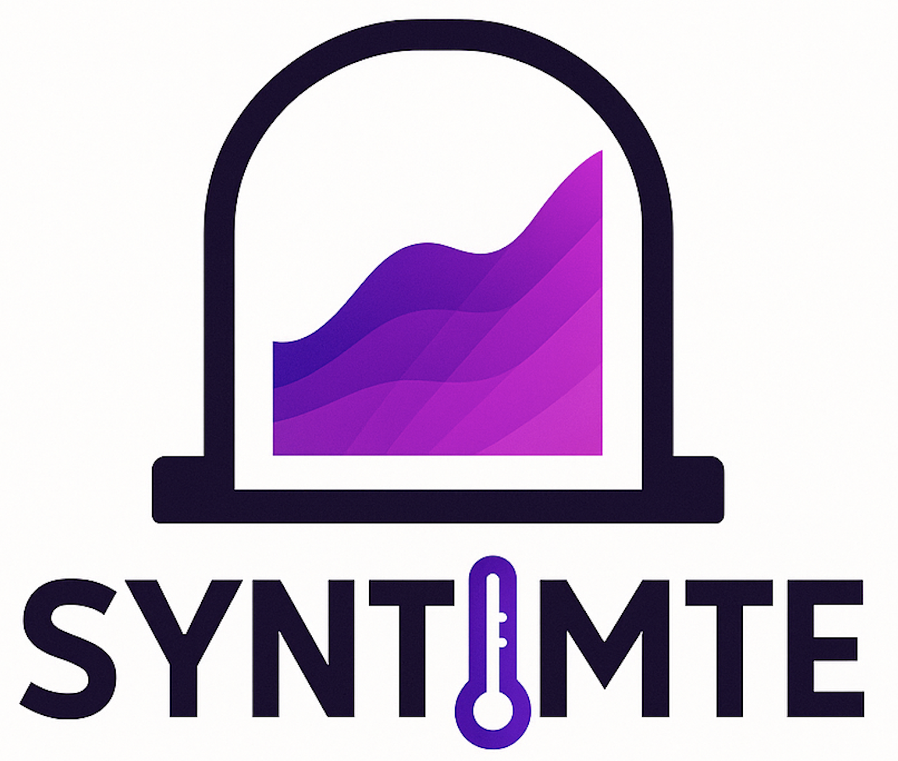
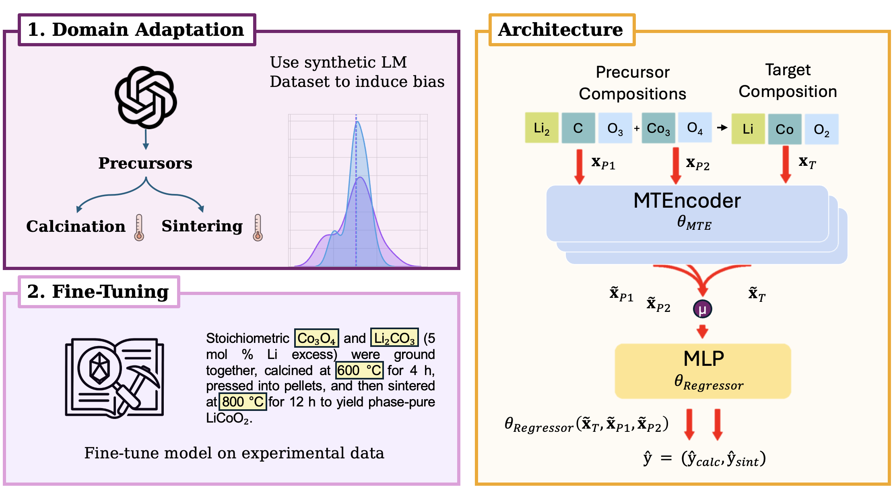

<div align="center">

<p align="center">
  
</p>

# SyntMTE: Synthesis Condition Prediction for Inorganic Solid-State Reactions

[](LICENSE)
[](https://www.python.org/downloads/)
[](https://github.com/psf/black)
[](https://optuna.org/)

*A machine learning project to predict material synthesis conditions, leveraging models like CrabNet, MTEncoder, and XGBoost to accelerate materials discovery. 🚀*

</div>

---


## 🎯 Why Predict Synthesis Conditions?

<p class="text-justify">
  Traditional materials discovery relies on a combination of domain expertise, chemical intuition, and extensive trial-and-error experimentation. This process is often slow, expensive, and limited in scope. Several tools have been developed to accelerate the materials discovery workflow. However, one of the most important steps remains the search for suitable synthesis conditions:
</p>

<div align="center">
  <strong>
    <em>User:</em> I want to synthesize Ba<sub>3</sub>FeO<sub>4</sub> 🔥
    <br>
    <em>SyntMTE:</em> What precursors are you planning to use?
    <br>
    <em>User:</em> Fe<sub>3</sub>O<sub>4</sub> and BaCO<sub>3</sub>.
    <br>
    <em>SyntMTE:</em> Understood. I suggest annealing for 10 hours at 815 °C, then sintering at 950 °C for 12 hours.
  </strong>
</div>

<br>

<p class="text-justify">
  This project provides a data-driven approach to synthesis parameter planning. By learning from successful experiments reported in the literature, our models can guide researchers toward more promising synthesis routes, saving time and resources. For more information, read the paper cited below.
</p>




## 🔑 Key Features

- 🎯 **Multiple Models**: Implements **CrabNet**, **MTEncoder**, and **XGBoost** for robust prediction.
- 🔌 **Plug-and-Play**: Easily train and evaluate different models using a unified interface.
- ⚡ **Hyperparameter Optimization**: Integrated with **Optuna** for efficient hyperparameter tuning.
- 📈 **Extensible**: Designed with a clear structure to facilitate the addition of new models and datasets.
- 📊 **Analysis Ready**: Includes notebooks for visualizing results and gaining insights from predictions.

## 🛠️ Installation

### Prerequisites
- Python 3.9 or higher
- A virtual environment manager like `uv` or `conda`

### Setup Instructions

1.  **Clone the repository**
    ```bash
    git clone https://github.com/Thorben010/SyntMTE.git
    cd SyntMTE
    ```

2.  **Create and activate environment** (using `uv`)
    ```bash
    uv venv
    source .venv/bin/activate
    ```

3.  **Install dependencies**
    ```bash
    uv pip install -r requirements.txt
    ```

4. **Download MTEncoder Checkpoint**
    The MTEncoder model uses pre-trained weights from a dedicated Hugging Face repository. Clone the repository into the `model_weights` directory:
    ```bash
    git clone https://huggingface.co/thor1/MTEncoder_alexandria model_weights
    ```

## 🏃‍♂️ Quick Start

The primary way to run this project is via the `src/main.py` script, which is conveniently wrapped by `run.bash`.


### Custom Training

You can customize runs by calling `src/main.py` directly. This allows you to specify the model, dataset, and other hyperparameters.

```bash
python3 src/main.py \
    --mode "train" \
    --embedder_type MTEncoder \
    --aggregation_mode "mean" \
    --dataset data/conditions/random_split 
```

### Hyperparameter Tuning

```bash
python3 src/main.py \
    --mode "tune" \
    --embedder_type MTEncoder \
    --aggregation_mode "mean" \
    --dataset data/conditions/random_split
```


### Inference

```bash
python3 src/main.py \
    --mode "predict" \
    --embedder_type MTEncoder \
    --aggregation_mode "mean" \
    --dataset data/conditions/random_split \
    --predict_dataset "data/conditions/random_split/test.csv" \
    --checkpoint_path path_to_trained_model
```

## 📂 Flag Descriptions
<details>
<summary>Click to view explanations.</summary>

| Flag                 | Type      | Choices                                       | Default                                                    | Description                                                                                    |
|----------------------|-----------|-----------------------------------------------|------------------------------------------------------------|------------------------------------------------------------------------------------------------|
| `mode`               | `string`  | `train`, `tune`, `predict`                    | `train`                                                    | Mode to run: standard training, hyperparameter optimization, or prediction.                  |
| `embedder_type`      | `string`  | `CrabNet`, `composition`, `MTEncoder`, `clr`  | `MTEncoder`                                                | Type of embedder to use in the model.                                                          |
| `aggregation_mode`   | `string`  | `attention`, `mean`, `max`, `sum`, `mean_max`, `conv`, `lstm`, `precursor_target_concat`, `concat` | `mean` | Type of aggregation to use for target and precursors.                                      |
| `dataset`            | `string`  | -                                             | `data/conditions/random_split` | Path to the dataset.                                                                          |
| `checkpoint_path`    | `string`  | -                                             | `.../logs/20250501-004811/best_model.pth`                  | Path to load a model checkpoint from.                                                          |
| `learning_rate`      | `float`   | -                                             | `0.0000439204`                                             | Learning rate for the optimizer (only used in training).                                   |
| `use_target_only`    | `bool`    | -                                             | `False`                                                    | If set, uses only the target material's representation for regression.                         |

</details>

<a id="citation"></a>
## 📝 Citation

If you use this work in your research, please cite our paper:

```bibtex
@article{Prein2025SyntMTE,
  author    = {Prein, Thorben and Pan, Elton and Jehkul, Janik and Weinmann, Steffen and Olivetti, Elsa A. and Rupp, Jennifer L. M.},
  title     = {Language Models Enable Data-Augmented Synthesis Planning for Inorganic Materials},
  journal   = {ACS Applied Materials & Interfaces},
  year      = {2025},
  note      = {Under Review}
}
```
